# Инструмент командной строки для визуализации графа зависимостей, включая транзитивные зависимости

## 1. Описание
**Git Dependency Graph Builder** — это инструмент для анализа зависимостей коммитов в репозитории Git. Программа читает историю коммитов, строит граф зависимостей и генерирует визуализацию в формате [PlantUML](https://plantuml.com).

Основные возможности:
- Чтение и анализ коммитов из `.git` директории.
- Построение графа зависимостей коммитов.
- Генерация PlantUML-кода для последующего визуального представления.

---
### Структура проекта:
```css
homework2/
├── src/
│   └── main.py          # Основной файл для запуска программы
├── config/
│   └── config.yaml      # Конфигурационный файл
│   ├── output.puml
│   └── plantuml.jar 
└── README.md            # Документация

```
## 2. Функции и настройки

### Основные функции
1. **Чтение конфигурационного файла**:
   - Путь к репозиторию.
   - Выводной файл для графа.
   - Путь к инструменту визуализации (PlantUML).

2. **Анализ и построение графа**:
   - Чтение объектов Git.
   - Построение зависимостей коммитов с рекурсивным обходом.

3. **Генерация PlantUML**:
   - Генерация текстового представления графа зависимостей.
   - Сохранение результата в файл.

4. **Логирование**:
   - Отслеживание ошибок и событий в процессе выполнения.

### Конфигурация
Настройки задаются в файле `config.yaml`. Пример структуры:
```yaml
visualization_tool_path: "../config/plantuml.jar"
repository_path: "D:/Users/rashi/GitHub/repository/test_repo"
output_file_path: "../config/output.puml"
tag_name: "v1.1.0"    # Путь к файлу вывода графа
```

---

## 3. Команды для сборки и запуска проекта


### Создание виртуального окружения

   ```python
   python -m venv .venv
   ```

### Активация виртуального окружения (Windows)

   ```bash
   .venv\Scripts\activate
   ```

### Активация виртуального окружения (MacOS/Linux)

   ```bash
   source venv/bin/activate
   ```

### Установка необходимых библиотек:

   ```bash
   pip install -r requirements.txt
   ```

### Запуск проекта

   ```bash
   python main.py
   ```

### Сгенерируйте изображение (опционально)
   Убедитесь, что [PlantUML](https://plantuml.com/download) установлен, и выполните:
   ```bash
   cd config
   java -jar plantuml.jar output.puml
   ```

---

## 4. Примеры использования

### Пример графа зависимостей
На основе репозитория будет создан граф. Пример кода PlantUML:

```plantuml
@startuml
state e77422804f8452836884b3751eaa71057fd407d6 <<state>> : Commit 12
cadb04c70a0f10b029a326553301dc1b96dae22c --> e77422804f8452836884b3751eaa71057fd407d6 : Commit 12
state c63f8d79af6e0f1afd08c649dc9171a28f991a8d <<state>> : Commit 16
5c5b0d2fe5c871c60618a2f9f857f11bd259049b --> c63f8d79af6e0f1afd08c649dc9171a28f991a8d : Commit 16
state 47d32394f69645fb6e61db4740ec7f399ddbd3ba <<state>> : Commit 2
aaaee08a066e5960782e44a70c5f25396eb96271 --> 47d32394f69645fb6e61db4740ec7f399ddbd3ba : Commit 2
state b2511f85600e68511d2d86a05596eee46a449b65 <<state>> : Commit 6
405d5862ad06c9a6a4e39a0b320320cc3cd98057 --> b2511f85600e68511d2d86a05596eee46a449b65 : Commit 6
state 3ff4358295be8d3345ffc532fb072e57bf7a38e0 <<state>> : Commit 18
ac484cdecc2c97718eba11c359bd0f63a7b4746d --> 3ff4358295be8d3345ffc532fb072e57bf7a38e0 : Commit 18
state eb57c71885aba52facc694fd30a7817d5a23c2df <<state>> : Commit 3
47d32394f69645fb6e61db4740ec7f399ddbd3ba --> eb57c71885aba52facc694fd30a7817d5a23c2df : Commit 3
state 4121a8643e7a9c51d9bd23a5184036ce0ce70f39 <<state>> : Commit 13
e77422804f8452836884b3751eaa71057fd407d6 --> 4121a8643e7a9c51d9bd23a5184036ce0ce70f39 : Commit 13
state ac484cdecc2c97718eba11c359bd0f63a7b4746d <<state>> : Commit 17
c63f8d79af6e0f1afd08c649dc9171a28f991a8d --> ac484cdecc2c97718eba11c359bd0f63a7b4746d : Commit 17
state 50573c153732ab71656454e47b0c99f6067d5a34 <<state>> : Commit 10
78ae79a95b7a5fb2143f0e17cf281e1b6d181676 --> 50573c153732ab71656454e47b0c99f6067d5a34 : Commit 10
state ea0e5c6d67b1571d81305eb8bce3fc31a97270b1 <<state>> : Commit 8
6e58bd9c9047b79682e5af3da447cb38009b44b4 --> ea0e5c6d67b1571d81305eb8bce3fc31a97270b1 : Commit 8
state cadb04c70a0f10b029a326553301dc1b96dae22c <<state>> : Commit 11
50573c153732ab71656454e47b0c99f6067d5a34 --> cadb04c70a0f10b029a326553301dc1b96dae22c : Commit 11
state 405d5862ad06c9a6a4e39a0b320320cc3cd98057 <<state>> : Commit 5
eaa2e08b8995cc6ca76d854fca52f4c0cba5f839 --> 405d5862ad06c9a6a4e39a0b320320cc3cd98057 : Commit 5
state 67ae7c776748af3a02d0ddcd189df23ba5b262b4 <<state>> : Commit 14
4121a8643e7a9c51d9bd23a5184036ce0ce70f39 --> 67ae7c776748af3a02d0ddcd189df23ba5b262b4 : Commit 14
state aaaee08a066e5960782e44a70c5f25396eb96271 <<state>> : Commit 1
a82f2ad06eb7e816154429e55cf0b3f03f9612c8 --> aaaee08a066e5960782e44a70c5f25396eb96271 : Commit 1
state eaa2e08b8995cc6ca76d854fca52f4c0cba5f839 <<state>> : Commit 4
eb57c71885aba52facc694fd30a7817d5a23c2df --> eaa2e08b8995cc6ca76d854fca52f4c0cba5f839 : Commit 4
state 7dc9464d8d8a1e40337cafe5adcc65b268fa2688 <<state>> : Commit 19
3ff4358295be8d3345ffc532fb072e57bf7a38e0 --> 7dc9464d8d8a1e40337cafe5adcc65b268fa2688 : Commit 19
state 8fc7eb61881d0878aa090f942f9445691928ed7d <<state>> : Second commit
e742c741b877d70003f1356affe37bbcb3a94d68 --> 8fc7eb61881d0878aa090f942f9445691928ed7d : Second commit
state 78ae79a95b7a5fb2143f0e17cf281e1b6d181676 <<state>> : Commit 9
ea0e5c6d67b1571d81305eb8bce3fc31a97270b1 --> 78ae79a95b7a5fb2143f0e17cf281e1b6d181676 : Commit 9
state a82f2ad06eb7e816154429e55cf0b3f03f9612c8 <<state>> : Commit $i
9c49a00f40796707fdcb827bdbbe281502e99f0e --> a82f2ad06eb7e816154429e55cf0b3f03f9612c8 : Commit $i
state 5c5b0d2fe5c871c60618a2f9f857f11bd259049b <<state>> : Commit 15
67ae7c776748af3a02d0ddcd189df23ba5b262b4 --> 5c5b0d2fe5c871c60618a2f9f857f11bd259049b : Commit 15
state 6e58bd9c9047b79682e5af3da447cb38009b44b4 <<state>> : Commit 7
b2511f85600e68511d2d86a05596eee46a449b65 --> 6e58bd9c9047b79682e5af3da447cb38009b44b4 : Commit 7
state 9e7aba8cf6e429836d8a2fce1d80fb6df0f96650 <<state>> : Commit 20
7dc9464d8d8a1e40337cafe5adcc65b268fa2688 --> 9e7aba8cf6e429836d8a2fce1d80fb6df0f96650 : Commit 20
state 9c49a00f40796707fdcb827bdbbe281502e99f0e <<state>> : Third commit
8fc7eb61881d0878aa090f942f9445691928ed7d --> 9c49a00f40796707fdcb827bdbbe281502e99f0e : Third commit
@enduml
```


После генерации граф может выглядеть так:


## 5. Результаты прогона тестов:


---
