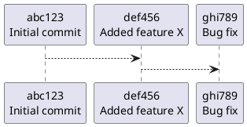

# Инструмент командной строки для визуализации графа зависимостей, включая транзитивные зависимости

## Описание
**Git Dependency Graph Builder** — это инструмент для анализа зависимостей коммитов в репозитории Git. Программа читает историю коммитов, строит граф зависимостей и генерирует визуализацию в формате [PlantUML](https://plantuml.com).

Основные возможности:
- Чтение и анализ коммитов из `.git` директории.
- Построение графа зависимостей коммитов.
- Генерация PlantUML-кода для последующего визуального представления.

---
## Описание
```css
homework2/
├── src/
│   └── main.py          # Основной файл для запуска программы
├── config/
│   └── config.yaml      # Конфигурационный файл
│   ├── output.puml
│   └── plantuml.jar 
└── README.md            # Документация

```
## Функции и настройки

### Основные функции
1. **Чтение конфигурационного файла**:
   - Путь к репозиторию.
   - Выводной файл для графа.
   - Путь к инструменту визуализации (PlantUML).

2. **Анализ и построение графа**:
   - Чтение объектов Git.
   - Построение зависимостей коммитов с рекурсивным обходом.

3. **Генерация PlantUML**:
   - Генерация текстового представления графа зависимостей.
   - Сохранение результата в файл.

4. **Логирование**:
   - Отслеживание ошибок и событий в процессе выполнения.

### Конфигурация
Настройки задаются в файле `config.yaml`. Пример структуры:
```yaml
visualization_tool_path: "../config/plantuml.jar"
repository_path: "D:/Users/rashi/GitHub/repository/test_repo"
output_file_path: "../config/output.puml"
tag_name: "v1.1.0"    # Путь к файлу вывода графа
```

---

## Команды для сборки и запуска проекта


1. **Установите зависимости**:
   ```bash
   pip install -r requirements.txt
   ```

2. **Запустите скрипт**:
   ```bash
   python main.py
   ```

3. **Сгенерируйте изображение (опционально)**:
   Убедитесь, что [PlantUML](https://plantuml.com/download) установлен, и выполните:
   ```bash
   plantuml ./output/graph.puml
   ```

---

## Примеры использования

### Пример графа зависимостей
На основе репозитория будет создан граф. Пример кода PlantUML:


После генерации граф может выглядеть так:


---
