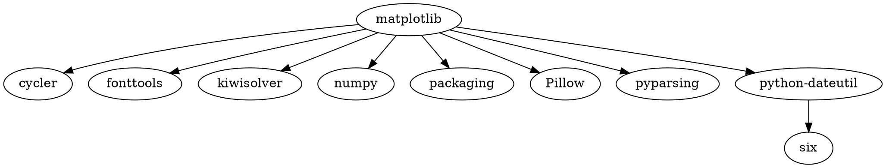
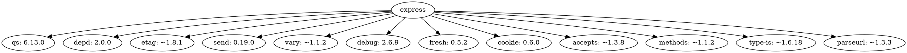

# Юсубов Рашид Хазеинович ИКБО-63-23
# Практическое занятие №2. Менеджеры пакетов

П.Н. Советов, РТУ МИРЭА

Разобраться, что представляет собой менеджер пакетов, как устроен пакет, как читать версии стандарта semver. Привести примеры программ, в которых имеется встроенный пакетный менеджер.

## Задача 1

Вывести служебную информацию о пакете matplotlib (Python). Разобрать основные элементы содержимого файла со служебной информацией из пакета. Как получить пакет без менеджера пакетов, прямо из репозитория?

## Решение:
Matplotlib -- это библиотека для создания визуализаций в Python. Основные элементы содержимого файла со служебной информацией:
## Служебная информация о пакете Matplotlib 

```pip show matplotlib```


1. **Имя пакета**: Matplotlib

2. **Версия**: 3.9.2

3. **Описание**: Пакет для построения графиков на Python

4. **Домашняя страница**: [matplotlib.org](http://matplotlib.org)

5. **Автор**: John D. Hunter, Michael Droettboom

6. **Автор-email**: Unknown <matplotlib-users@python.org>

7. **Лицензия**:License agreement for matplotlib versions 1.3.0 and later


## Получение пакета без менеджера пакетов

Чтобы установить Matplotlib без использования менеджера пакетов, нужно выполнить следующие шаги:

1. **Скачать архив с исходным кодом**:

   -  Перейти на страницу релизов Matplotlib на GitHub и скачать последнюю версию архива с исходным кодом.

2. **Распаковать архив**:

3. **Перейти в директорию с исходным кодом**:

   -  Использовать команду `cd имя_директории`, чтобы перейти в директорию, содержащую файл `setup.py`.

4. **Установите пакет**:

   -  Выполнить команду `python setup.py install`, чтобы установить пакет.

## Задача 2

Вывести служебную информацию о пакете express (JavaScript). Разобрать основные элементы содержимого файла со служебной информацией из пакета. Как получить пакет без менеджера пакетов, прямо из репозитория?

## Решение:
Express -- это минималистичный и гибкий веб-фреймворк для Node.js, который предоставляет мощный набор функций для веб и мобильных приложений.
## Служебная информация о пакете Express
```npm show express```


# Пакет Express

## Служебная информация о пакете

- **Имя**: express
- **Версия**: 4.21.0
- **Лицензия**: MIT
- **Зависимости**: 31
- **Количество версий**: 279
- **Описание**: Fast, unopinionated, minimalist web framework
- **Ссылка на документацию**: [http://expressjs.com/](http://expressjs.com/)

### Ключевые слова
`express`, `framework`, `sinatra`, `web`, `http`, `rest`, `restful`, `router`, `app`, `api`

### Дистрибутив
- **tarball**: [https://registry.npmjs.org/express/-/express-4.21.0.tgz](https://registry.npmjs.org/express/-/express-4.21.0.tgz)
- **shasum**: d57cb706d49623d4ac27833f1cbc466b668eb915
- **integrity**: sha512-VqcNGcj/Id5ZT1LZ/cfihi3ttTn+NJmkli2eZADigjq29qTlWi/hAQ43t/VLPq8+UX06FCEx3ByOYet6ZFblng==
- **unpackedSize**: 220.8 kB

### Зависимости
- `accepts`: ~1.3.8
- `body-parser`: 1.20.3
- `content-type`: ~1.0.4
- `cookie`: 0.6.0
- `debug`: 2.6.9
- `dep`: 2.0.0
- `encodeurl`: ~2.0.0
- `escape-html`: ~1.0.3
- `etag`: ~1.8.1
- `finalhandler`: 1.3.1
- `fresh`: 0.5.2
- `http-errors`: 2.0.0
- `methods`: ~1.1.2
- `on-finished`: 2.4.1
- `parseurl`: ~1.3.3
- `proxy-addr`: ~2.0.7
- `qs`: 6.13.0
- `range-parser`: ~1.2.1
- `safe-buffer`: 5.2.1
- `send`: 0.19.0
- `statuses`: 2.0.1
- `type-is`: ~1.6.18
- `utils-merge`: 1.0.1
- `vary`: ~1.1.2

### Поддержка
**Управляющие**:
- wesleytodd <wes@wesleytodd.com>
- dougwilson <doug@somethingdoug.com>
- linusu <linus@folkdatorn.se>
- sheplu <jean.burellier@gmail.com>
- blakeembrey <hello@blakeembrey.com>
- ulisesgascon <ulisesgascondev@gmail.com>
- mikeal <mikeal.rogers@gmail.com>

### Дистрибутивные метки
- **latest**: 4.21.0
- **next**: 5.0.0

### Дата публикации
Опубликовано 3 недели назад автором wesleytodd <wes@wesleytodd.com>


## Получение пакета без менеджера пакетов

Чтобы установить пакет Express без использования менеджера пакетов, вы можете сделать это напрямую из репозитория. Вот шаги, которые нужно выполнить:

1. **Скачать репозиторий с GitHub**:

   -  Использовать команду `git clone`, чтобы клонировать репозиторий Express. Например:

      ```
      git clone https://github.com/expressjs/express.git
      ```

2. **Перейти в директорию с исходным кодом**:

   -  Использовать команду `cd`, чтобы перейти в директорию, содержащую исходный код Express. Например:

      ```
      cd express
      ```

3. **Установка зависимости**:

   -  Выполнить команду `npm install`, чтобы установить все необходимые зависимости. 

4. **Запуск приложения**:

   -  Запустить приложение, используя команду `node`. Например:

      ```
      node examples/content-negotiation
      ```

## Задача 3

Сформировать graphviz-код и получить изображения зависимостей matplotlib и express.

## Решение:
## График зависимостей matplotlib

## Результат:

## График зависимостей express

## Результат:

## Задача 4

**Следующие задачи можно решать с помощью инструментов на выбор:**

* Решатель задачи удовлетворения ограничениям (MiniZinc).
* SAT-решатель (MiniSAT).
* SMT-решатель (Z3).

Изучить основы программирования в ограничениях. Установить MiniZinc, разобраться с основами его синтаксиса и работы в IDE.

Решить на MiniZinc задачу о счастливых билетах. Добавить ограничение на то, что все цифры билета должны быть различными (подсказка: используйте all_different). Найти минимальное решение для суммы 3 цифр.

## Решение:
```MiniZinc
include "globals.mzn"; % Импорт библиотеки с функцией all_different

int: n = 6; % количество цифр в билете
set of int: Digits = 0..9; % возможные цифры

% Переменные
array[1..n] of var Digits: ticket; % массив из 6 цифр

% Ограничение: все цифры должны быть различными
constraint all_different(ticket);

% Ограничения на суммы
constraint sum(ticket[1..3]) = sum(ticket[4..6]);

% Ограничение: минимальная сумма трех цифр
constraint sum(ticket[1..3]) >= 6;

% Поиск решения
solve satisfy;

% Вывод результата
output ["Ticket: \(ticket)"];
```
## Результат:


## Задача 5

Решить на MiniZinc задачу о зависимостях пакетов для рисунка, приведенного ниже.


## Решение:
```MiniZinc
include "globals.mzn";

% Определяем версии пакетов
enum Version = {v1_0_0, v1_1_0, v1_2_0, v1_3_0, v1_4_0, v1_5_0, v1_8_0, v2_0_0, v2_1_0, v2_2_0, v2_3_0};

% Определяем пакеты
enum Package = {menu, dropdown, icons};

% Массив для хранения выбранных версий пакетов
array[Package] of var Version: versions;

% Зависимости пакетов
array[Package] of set of Version: dependencies = [
    {v1_0_0, v1_1_0, v1_2_0, v1_3_0, v1_4_0, v1_5_0}, % menu
    {v1_8_0, v2_0_0, v2_1_0, v2_2_0, v2_3_0}, % dropdown
    {v1_0_0, v2_0_0} % icons
];

% Ограничение для версии menu
constraint versions[menu] = v1_5_0; 

% Ограничение: root зависит от menu, добавим переменную для root
var Version: root_version;

% Ограничение: root_version должен быть в зависимостях menu
constraint root_version in dependencies[menu];

solve satisfy;

% Вывод результата
output ["Версии:\n"] ++
  [ show(versions[p]) ++ " " ++ show(p) ++ "\n" | p in Package] ++
  ["Root Версии: " ++ show(root_version)];
```
## Результат:

## Задача 6

Решить на MiniZinc задачу о зависимостях пакетов для следующих данных:

```
root 1.0.0 зависит от foo ^1.0.0 и target ^2.0.0.
foo 1.1.0 зависит от left ^1.0.0 и right ^1.0.0.
foo 1.0.0 не имеет зависимостей.
left 1.0.0 зависит от shared >=1.0.0.
right 1.0.0 зависит от shared <2.0.0.
shared 2.0.0 не имеет зависимостей.
shared 1.0.0 зависит от target ^1.0.0.
target 2.0.0 и 1.0.0 не имеют зависимостей.
```

## Решение:
```MiniZinc
% Определение пакетов и их версий
enum Version = {v1_0_0, v1_1_0, v2_0_0};

% Пакеты
enum Package = {root, foo, left, right, shared, target};

% Массив для хранения версий каждого пакета
array[Package] of var Version: versions;

% Зависимости
% Зависимость вида: пакет A зависит от пакета B версии C
% Функция valid_dependency(p, v) проверяет, что версия v пакета p находится в указанном диапазоне

% root 1.0.0 зависит от foo ^1.0.0 и target ^2.0.0
constraint versions[root] = v1_0_0;
constraint (versions[foo] = v1_0_0 \/ versions[foo] = v1_1_0);
constraint versions[target] = v2_0_0;

% foo 1.1.0 зависит от left ^1.0.0 и right ^1.0.0
constraint versions[foo] = v1_1_0 -> (versions[left] = v1_0_0 /\ versions[right] = v1_0_0);

% foo 1.0.0 не имеет зависимостей
% Это автоматически выполняется, так как нет дополнительных ограничений для foo 1.0.0

% left 1.0.0 зависит от shared >=1.0.0
constraint versions[left] = v1_0_0 -> (versions[shared] = v1_0_0 \/ versions[shared] = v2_0_0);

% right 1.0.0 зависит от shared <2.0.0
constraint versions[right] = v1_0_0 -> (versions[shared] = v1_0_0);

% shared 2.0.0 не имеет зависимостей
% shared 1.0.0 зависит от target ^1.0.0
constraint versions[shared] = v1_0_0 -> (versions[target] = v1_0_0);

% target 2.0.0 и 1.0.0 не имеют зависимостей
% Эти ограничения включены в выбор версий

solve satisfy;

% Вывод результата
output ["Versions:\n"] ++
  [ show(versions[p]) ++ " " ++ show(p) ++ "\n" | p in Package];
```
## Результат:

## Задача 7

Представить задачу о зависимостях пакетов в общей форме. Здесь необходимо действовать аналогично реальному менеджеру пакетов. То есть получить описание пакета, а также его зависимости в виде структуры данных. Например, в виде словаря. В предыдущих задачах зависимости были явно заданы в системе ограничений. Теперь же систему ограничений надо построить автоматически, по метаданным.

## Решение:
```Python
# Описание пакетов и их зависимостей
packages = {
    "root": {
        "version": "1.0.0",
        "dependencies": {
            "foo": "^1.0.0",
            "target": "^2.0.0"
        }
    },
    "foo": {
        "version": "1.1.0",
        "dependencies": {
            "left": "^1.0.0",
            "right": "^1.0.0"
        }
    },
    "left": {
        "version": "1.0.0",
        "dependencies": {
            "shared": ">=1.0.0"
        }
    },
    "right": {
        "version": "1.0.0",
        "dependencies": {
            "shared": "<2.0.0"
        }
    },
    "shared": {
        "version": "2.0.0",
        "dependencies": {}
    },
    "target": {
        "version": "2.0.0",
        "dependencies": {}
    }
}

# Функция для получения зависимостей пакета
def get_dependencies(package_name):
    if package_name in packages:
        return packages[package_name]["dependencies"]
    else:
        return None

# Пример использования
package_name = "foo"
dependencies = get_dependencies(package_name)
if dependencies:
    print(f"Зависимости пакета {package_name}:")
    for dep, version in dependencies.items():
        print(f"  - {dep}: {version}")
else:
    print(f"Пакет {package_name} не найден.")
constraints = []

def add_constraints(package_name):
    if package_name not in packages:
        return

    dependencies = packages[package_name]["dependencies"]
    for dep, version in dependencies.items():
        # Создаем ограничения на основе зависимостей
        constraints.append(f"{package_name} -> {dep} {version}")
        add_constraints(dep)  # Рекурсивно добавляем зависимости

# Добавление ограничений для корневого пакета
add_constraints("root")

# Печать сгенерированных ограничений
print("Сгенерированные ограничения:")
for constraint in constraints:
    print(constraint)
```
## Результат:

## Полезные ссылки

Semver: https://devhints.io/semver

Удовлетворение ограничений и программирование в ограничениях: http://intsys.msu.ru/magazine/archive/v15(1-4)/shcherbina-053-170.pdf

Скачать MiniZinc: https://www.minizinc.org/software.html

Документация на MiniZinc: https://www.minizinc.org/doc-2.5.5/en/part_2_tutorial.html

Задача о счастливых билетах: https://ru.wikipedia.org/wiki/%D0%A1%D1%87%D0%B0%D1%81%D1%82%D0%BB%D0%B8%D0%B2%D1%8B%D0%B9_%D0%B1%D0%B8%D0%BB%D0%B5%D1%82
