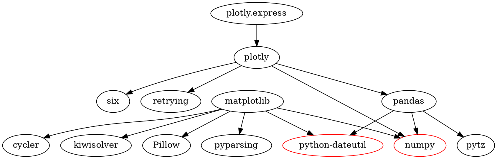

# Практическое занятие №2. Менеджеры пакетов

П.Н. Советов, РТУ МИРЭА

Разобраться, что представляет собой менеджер пакетов, как устроен пакет, как читать версии стандарта semver. Привести примеры программ, в которых имеется встроенный пакетный менеджер.

## Задача 1

Вывести служебную информацию о пакете matplotlib (Python). Разобрать основные элементы содержимого файла со служебной информацией из пакета. Как получить пакет без менеджера пакетов, прямо из репозитория?

## Решение:

**Служебная информация о пакете Matplotlib**

Matplotlib -- это библиотека для создания визуализаций в Python. Основные элементы содержимого файла со служебной информацией:

1. **Имя пакета**: Matplotlib

2. **Версия**: 3.9.2 (на момент последнего обновления)

3. **Описание**: Библиотека для создания визуализаций в Python

4. **Домашняя страница**: [matplotlib.org](http://matplotlib.org)

5. **Автор**: John D. Hunter, Michael Droettboom

6. **Требуемые зависимости**: cycler, numpy, kiwisolver, python-dateutil, pyparsing

7. **Лицензия**: PSF (Python Software Foundation)


**Получение пакета без менеджера пакетов**

Чтобы установить Matplotlib без использования менеджера пакетов, нужно выполнить следующие шаги:

1. **Скачать архив с исходным кодом**:

   -  Перейти на страницу релизов Matplotlib на GitHub и скачать последнюю версию архива с исходным кодом.

2. **Распаковать архив**:

   -  Использовать команду `Expand-Archive -Path "путь_к_архиву.zip" -DestinationPath "путь_к_папке"` для распаковки архива

3. **Перейти в директорию с исходным кодом**:

   -  Использовать команду `cd имя_директории`, чтобы перейти в директорию, содержащую файл `setup.py`.

4. **Установите пакет**:

   -  Выполнить команду `python setup.py install`, чтобы установить пакет.

## Задача 2

Вывести служебную информацию о пакете express (JavaScript). Разобрать основные элементы содержимого файла со служебной информацией из пакета. Как получить пакет без менеджера пакетов, прямо из репозитория?

## Решение:
### **Служебная информация о пакете Express**

Express -- это минималистичный и гибкий веб-фреймворк для Node.js, который предоставляет мощный набор функций для веб и мобильных приложений.

#### Основные элементы содержимого файла со служебной информацией:

1. **Имя пакета**: Express

2. **Версия**: 4.21.0 (на момент последнего обновления)

3. **Описание**: Быстрый, минималистичный веб-фреймворк для Node.js

4. **Домашняя страница**: [expressjs.com](http://expressjs.com)

5. **Автор**: TJ Holowaychuk

6. **Требуемые зависимости**: body-parser, cookie-parser, debug, etag, finalhandler, methods, parseurl, path-to-regexp, proxy-addr, qs, range-parser, send, serve-static, type-is, utils-merge, vary

7. **Лицензия**: MIT

### **Получение пакета без менеджера пакетов**

Чтобы установить пакет Express без использования менеджера пакетов, вы можете сделать это напрямую из репозитория. Вот шаги, которые нужно выполнить:

1. **Скачать репозиторий с GitHub**:

   -  Использовать команду `git clone`, чтобы клонировать репозиторий Express. Например:

      ```
      git clone https://github.com/expressjs/express.git
      ```

2. **Перейти в директорию с исходным кодом**:

   -  Использовать команду `cd`, чтобы перейти в директорию, содержащую исходный код Express. Например:

      ```
      cd express
      ```

3. **Установка зависимости**:

   -  Выполнить команду `npm install`, чтобы установить все необходимые зависимости. 

4. **Запуск приложения**:

   -  Вы можете запустить приложение, используя команду `node`. Например:

      ```
      node examples/content-negotiation
      ```

## Задача 3

Сформировать graphviz-код и получить изображения зависимостей matplotlib и express.

## Решение:

## Результат:

## Задача 4

**Следующие задачи можно решать с помощью инструментов на выбор:**

* Решатель задачи удовлетворения ограничениям (MiniZinc).
* SAT-решатель (MiniSAT).
* SMT-решатель (Z3).

Изучить основы программирования в ограничениях. Установить MiniZinc, разобраться с основами его синтаксиса и работы в IDE.

Решить на MiniZinc задачу о счастливых билетах. Добавить ограничение на то, что все цифры билета должны быть различными (подсказка: используйте all_different). Найти минимальное решение для суммы 3 цифр.

## Решение:
```MiniZinc
include "globals.mzn"; % Импорт библиотеки с функцией all_different

int: n = 6; % количество цифр в билете
set of int: Digits = 0..9; % возможные цифры

% Переменные
array[1..n] of var Digits: ticket; % массив из 6 цифр

% Ограничение: все цифры должны быть различными
constraint all_different(ticket);

% Ограничения на суммы
constraint sum(ticket[1..3]) = sum(ticket[4..6]);

% Ограничение: минимальная сумма трех цифр
constraint sum(ticket[1..3]) >= 6;

% Поиск решения
solve satisfy;

% Вывод результата
output ["Ticket: \(ticket)"];
```
## Результат:


## Задача 5

Решить на MiniZinc задачу о зависимостях пакетов для рисунка, приведенного ниже.


## Решение:
```
```
## Результат:


## Задача 6

Решить на MiniZinc задачу о зависимостях пакетов для следующих данных:

```
root 1.0.0 зависит от foo ^1.0.0 и target ^2.0.0.
foo 1.1.0 зависит от left ^1.0.0 и right ^1.0.0.
foo 1.0.0 не имеет зависимостей.
left 1.0.0 зависит от shared >=1.0.0.
right 1.0.0 зависит от shared <2.0.0.
shared 2.0.0 не имеет зависимостей.
shared 1.0.0 зависит от target ^1.0.0.
target 2.0.0 и 1.0.0 не имеют зависимостей.
```

## Решение:
```
```
## Результат:


## Задача 7

Представить задачу о зависимостях пакетов в общей форме. Здесь необходимо действовать аналогично реальному менеджеру пакетов. То есть получить описание пакета, а также его зависимости в виде структуры данных. Например, в виде словаря. В предыдущих задачах зависимости были явно заданы в системе ограничений. Теперь же систему ограничений надо построить автоматически, по метаданным.

## Решение:
```
```
## Результат:


## Полезные ссылки

Semver: https://devhints.io/semver

Удовлетворение ограничений и программирование в ограничениях: http://intsys.msu.ru/magazine/archive/v15(1-4)/shcherbina-053-170.pdf

Скачать MiniZinc: https://www.minizinc.org/software.html

Документация на MiniZinc: https://www.minizinc.org/doc-2.5.5/en/part_2_tutorial.html

Задача о счастливых билетах: https://ru.wikipedia.org/wiki/%D0%A1%D1%87%D0%B0%D1%81%D1%82%D0%BB%D0%B8%D0%B2%D1%8B%D0%B9_%D0%B1%D0%B8%D0%BB%D0%B5%D1%82
